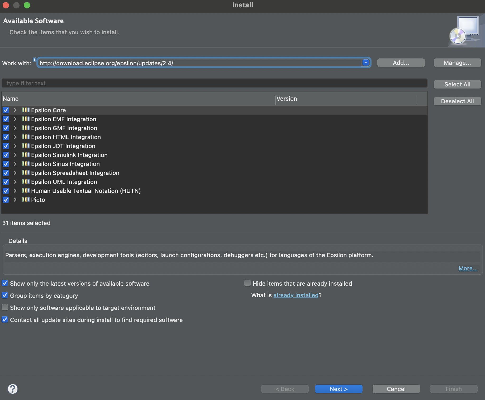

# Eclipse Epsilon

Epsilon is a family of scripting languages and tools for automating common model-based software engineering tasks such as code generation, model-to-model transformation, model validation and model visualisation, that work out of the box with EMF, UML, Simulink, XML and other types of models.

Epsilon can be used as a standard Java library, and also provides Apache Ant tasks that can be embedded in Maven/Gradle builds. Editing support for Epsilon programs is available in Eclipse, VS Code and Sublime.

## Installation

### Method 1: (Eclipse Marketplace - Recommended)
The best and quickest way to install the latest version of Epsilon is through the Eclipse Marketplace. To do this head over to ```Help → Eclipse Marketplace``` 


### Method 2: (Update Sites)
You can also use one of the following update sites through the ```Help → Install new software``` menu in Eclipse to install (parts of) Epsilon. Enter one of the links below in the ``Work with:`` field and tick all the options (Epsilon Core artifact is required). Then click ```Next → Finish``` to install Epsilon on your Eclipse platform.

| Site | Location |
| - | - |
| Stable (recommended) | `http://download.eclipse.org/epsilon/updates/2.4/`|
| Interim | `http://download.eclipse.org/epsilon/interim/`|



### Method 3: (Eclipse Marketplace website)
Another way is to head over to the [Eclipse Marketplace site](https://marketplace.eclipse.org/search/site/epsilon). Drag and drop the install button into your Eclipse IDE and finish the installation.


