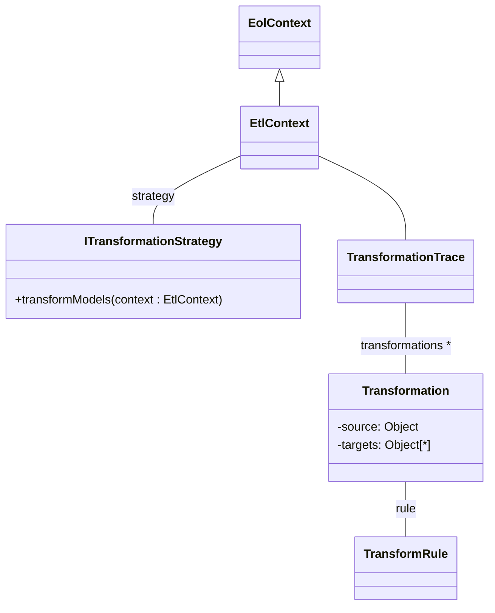

# ETL

Epsilon's core is the general purpose model management language called Epsilon Object Language (EOL). EOL is meant to be reused in task specific languages. One such language is Epsilon Transformation Language (ETL) which is used to perform model-to-model transformations. ETL is a hybrid of declarative and imperative paradigms. It provides abstract rule-based execution of tasks as well as imperative EOL features to handle various transformation needs. ETL can be used to transform an arbitrary number of input models into a arbitrary number of output models of different modelling languages and technologies in a rule-based and modular manner.

## Project Structure

An ETL model-to-model transformation project (see image below) requires a source model, source metamodel, target metamodel, an ETL program that contains the rules and transformations between the source and target model, and a build file which loads all EMF models and runs the ETL program to generate the target model (an XMI file in this case).
<br/><br/>

<figure markdown>
  { width="300" }
  <figcaption>File structure of an example ETL project</figcaption>
</figure>

## Installation

To use ETL, you just need to install [Epsilon on Eclipse](epsilon.md).

## ETL Basics

Before you get started on your own ETL project, let's introduce the basics of ETL through the syntax and semantics.

### Abstract Syntax

<figure markdown>
  ```mermaid
  classDiagram
  class TransformRule {
      -name: String
      -abstract: Boolean
      -lazy: Boolean
      -primary: Boolean
      -greedy: Boolean
      -type: EolModelElementType
      -guard: ExecutableBlock<Boolean>
      -body: ExecutableBlock<Void>
  }
  class Parameter {
      -name: String
      -type: EolType 
  }
  class NamedStatementBlockRule {
      -name: String
      -body: StatementBlock
  }
  EolModule <|-- ErlModule
  EtlModule --|> ErlModule
  Pre --|> NamedStatementBlockRule
  Post --|> NamedStatementBlockRule
  ErlModule -- Pre: pre *
  ErlModule -- Post: post *
  EtlModule -- TransformRule: rules *
  TransformRule -- Parameter: source
  TransformRule -- Parameter: targets *
  TransformRule -- TransformRule: extends *
  ```
  <figcaption>ETL constructs and relationships</figcaption>
</figure>


The figure above represents ETL at a high level. In ETL, modules represent the model transformations. ```EtlModule``` can have one or more transformation rules (```TransformRule```). 

Each ```TransformRule``` provides a mapping between a ``source`` model parameter and ``target`` model parameter(s). It has some important characteristics:

* The name of a rule is **unique** within the context of a module.
* Each rule has **only one** ```source``` parameter and can have **one or more** ``target`` parameters.
* A transformation rule can ``extend`` other rules.
* You can declare a rule as ``abstract``, ``primary`` and/or ``lazy`` (explained in the next section).
* An optional 'guard' selection statement can be defined to filter only certain elements (of specific attributes) that conform to the type of the ``source`` parameter.
* Each rule has a ``body``. This is a block of EOL statements where the logic for assigning field values of target model is imperatively defined.

ETL also allows users to declare ``pre`` and ``post`` blocks which are executed before and after the transformation rules.

!!! warning
    These ``pre`` and ``post`` blocks are different to the pre-/post-condition annotations available for EOL user-defined operations

### Concrete Syntax

The basic format of an ETL document is as follows: 

```
rule <name>
    transform <sourceParameterName>:<sourceParameterType>
    to <targetParameterName>:<targetParameterType>
        (,<targetParameterName>:<targetParameterType>)* {
        
    //Transformation rule body is comprised of EOL statement(s)
    statement+

}
```
**Note:** *<> is meant to show user-definable fields and is not part of the actual syntax*

Name of a ``rule`` is uniquely identified within an ETL module and it can contain numbers from 0-9. All contents in a rule's scope are indented. ``transform`` statement requires the name and type of the ``source`` parameter. ``to`` statement requires the name and type of the ``target`` parameter. There can be multiple target parameters which are each separated using comma (,). Curly braces ({}) just after the ``to`` statement defines the scope of the rule's ``body``. The body comprises of EOL statement(s) that can assign attribute values to ``target`` model elements.

ETL can also have optional attributes and statements that increase usability of the tool. The options are structured in the following manner:

```
(@abstract)?
(@lazy)?
(@primary)?
rule <name>
    transform <sourceParameterName>:<sourceParameterType>
    to <targetParameterName>:<targetParameterType>
        (,<targetParameterName>:<targetParameterType>)*
    (extends <ruleName> (, <ruleName>*)? {

    (guard (:expression)|({statementBlock}))?

    statement+
}

```

**Note:** *(option)? is meant to show optional fields and is not part of the actual syntax*

``@abstract``, ``@lazy`` and ``@primary`` optional attributes of a rule are defined on the line prior to the ``rule`` keyword. ``@abstract`` is used to declare rules that will be extended using the programming concept of inheritance. Rules declared as ``@lazy`` are executed after all the non-lazy rules have been executed. Results of the ``equivalents()`` operation can be prioritized (ordered) using rules that are declared``@primary``. Meaning, results of *primary* rules precede the results of all the other rules.

A rule can extend **one or more** rules using the ``extends`` keyword after the ``to`` statement. Multiple extended rules form a comma-separated list.

An optional ``guard`` is a type of filter or a selection statement which is declared in the curly braces ({}) that contains a rule's ``body``. A simple *guard* is an EOL expression following a column (:) and a complex *guard* is a block of EOL statements enclosed in curly braces ({}).

Apart from rules, ETL also includes ``pre`` and ``post`` blocks of EOL statements. The syntax for them is the keyword identifier as ``pre`` or ``post``, followed by an optional name and a set of EOL statments enclosed in curly braces ({}).

```
(pre|post) <name> {
    statement+
}
```

### Execution Semantics

#### Rule and Block Overriding

Users can import other ETL modules within an ETL module. The importing ETL module (containing ``import`` keyword) inherits all the rules and pre/post blocks specified in the modules it imports (recursively).

If the importing module specifies a rule or pre/post block with the same name as one from the imported module, then the local rule/block is prioritised and it overrides the imported one.

#### Execution Scheduling

<figure markdown>
  ``` mermaid
  graph LR
      A[pre block] --> B[rules];
      B --> C[post block];
  ```
  <figcaption>Flow of statement execution</figcaption>
</figure>

When an ETL module is executed, the ``pre`` blocks are executed first. If there are multiple ``pre`` blocks, then they are executed sequentially in the order defined.

Next, each non-abstract and non-lazy ``rule`` is executed for all elements on which the rule is applicable. To be applicable on a particular element, the element must have a type-of relationship (``sourceParameter`` fields must be filled) or a kind-of relationship (if the ``rule`` is annotated as ``@greedy``). Additionally, the element must satisfy the ``guard`` of the rule (and all rules it extends). Then the ``@abstract`` and  ``@lazy`` rules are executed in order.

After all rules have been executed, the ``post`` blocks are executed in the order they have been specified.

#### Source Element Resolution

Resolving source elements is a common task in the execution of a rule and this has been automated by ETL. This also helps in reducing coupling between different rules and keeps the mappings between source and target elements clear. ETL contains ``equivalent()`` and ``equivalents()`` built-in operations that automatically resolve source elements to the corresponding target elements.

**equivalents()**

``equivalents()`` operation has different behaviours when applied to a single source element or a collection of elements. When applied on a single element, the operation inspects the transformation trace (see figure below) and invokes rules that are applicable to calculate the target element. When the operation is applied on a collection, a ``Bag`` containing Bags which contain the corresponding target elements of the original source elements is returned. Optionally, `equivalents()` operation can be invoked with a number of rule names as parameters to return equivalents created by specific rules. The execution of this operation also differs from the 'Execution Scheduling' discussed before, because ``equivalents()`` operation invokes both lazy and non-lazy rules.

The ordering of the ``equivalents()`` operations is sequential and runs in the order of the rules defined. However, this is not the case when a rule is declared ``@primary`` in which case the results of that rule will precede all of the other rules.




**equivalent()**

The `equivalent()` operation also has different behaviours when applied to a single source element or a collection. When the operation is applied to a single element only the first element of the result that would have been returned by the ``equivalents()`` operation is returned. When applied on a collection, the operation returns a flattened collection. Optionally, ``equivalent()`` operation can be invoked with or without parameters.

#### Interactive Transformations

EOL statements can provide interactive capabilities to ETL transformations. In the example below, ``Tree2Node`` rule is modified by adding a ``guard`` statement which uses EOL's user-input method (`UserInput.confirm(String,Boolean)`) to ask for user's permission and confirmation of selecting specific Tree elements that need to be transformed to Node elements. The confirmation prompt appears at runtime hence making the model transformation interactive.

```
rule Tree2Node
    transform t : Tree!Tree
    to n : Graph!Node {

    guard : UserInput.confirm
        ("Transform tree " + t.label + "?", true)

    n.label = t.label;
    var target : Graph!Node ::= t.parent;
    if (target.isDefined()) {
        var edge = new Graph!Edge;
        edge.source = n;
        edge.target = target;
    }
}
```


## Simple Tutorial

To demonstrate the ETL capabilities, let's look at a simple example that reverses a linked list using ETL. A linked list with 2 nodes (N1 and N2) is reversed through model transformation.

**Source Model**
<figure markdown>
  { width="300" }
  <figcaption>Linked list BEFORE transformation</figcaption>
</figure>

**Target Model**
<figure markdown>
  { width="300" }
  <figcaption>Linked list AFTER transformation</figcaption>
</figure>
<br/><br/>

### Transformation (ETL)

There are 2 aspects of the linked list which are changed from the source model to the target model (thus requiring two rules): 

1. The head of the linked list is swapped with its tail. 
2. The nodes are reversed i.e. pointing to the previous node instead of the next one.


**First, the linked list's head is reversed:**

``` linenums="1"
rule LinkedList2LinkedList 
    transform s : Source!LinkedList
    to t : Target!LinkedList {
        
    t.nodes ::= s.nodes;
    t.head ::= Source!Node.all.selectOne(n|n.next == null);
}
```

Let's have a look at each line of code to understand ETL logic and semantics:

In line 1, ``rule`` declares a transformation rule with a unique name 'LinkedList2LinkedList'. <br> 
In line 2, ``transform`` keyword indicates the source parameter we want to transform in this rule. Thus, a source parameter name 's' and a source parameter type 'Source!LinkedList' (the source metamodel's LinkedList class is being referenced here). <br> 
In line 3, similar to the previous line's format, `to` keyword is followed by the target parameter name 't' and target parameter type 'Target!LinkedList'. The target element properties are being configured here. The open curly brace ({) indicates the start of the rule's ``body``.<br>
In line 5, the target element's nodes are assigned using the EOL SpecialAssignment operator (::=) to be the equivalent of the source element's nodes. Please note that ::= is the same as an ``equivalent()`` operation. <br>
In line 6, the target element's head ``t.head`` is assigned the equivalent value of a node from the source model that points to ``null`` i.e. it is the last node.<br>
In line 7, the close curly brace (}) indicates the end of the ``body`` and the dedent means the end of the transformation rule.

**Second, the nodes are reversed:**

``` linenums="1"
rule Node2Node
    transform s : Source!Node
    to t : Target!Node {
    
    t.name = s.name;
    t.next ::= Source!Node.all.selectOne(n|n.next = s);
}
```

In this rule, the source and target parameter types are also the same. Remember, the linked list is only meant to be reversed hence the structural properties of the linked list remain unchanged. In the ``transform`` statement, a source parameter 's' of the type 'Source!Node' (Node class in the source metamodel) is transformed ``to`` the target parameter 't' of the type 'Target!Node' (same Node class definition as in the source metamodel). The target element is assigned the same name as the source element. SpecialAssignment operator (::=) is not used here because ``name`` is a string attribute of a ``Node`` class and not a reference. The target element's ``next`` property is assigned the equivalent value of a node from the source model whos ``next`` value is the source node element 's'.

The example project also includes other important files: Source model (.xmi), Source metamodel (.emf) and a Target metamodel (.emf) which are listed below.

### Source Model

```
<?nsuri linkedlist?>
<linkedlist head="N1">
    <node label="N1" next="N2"/>
    <node label="N2"/>
</linkedlist>
```

### Source and Target Metamodel

```
@namespace(uri="linkedlist", prefix="")
package linkedlist;

class LinkedList {
	ref Node head;
	val Node[*] nodes;
}

class Node {
    attr String name;
    ref Node next;
}
```

**Note:** Usually source and target metamodels may not be the same. In this linked list reversal example, the data structure did not need to be changed but the property values.


## Development Platforms

There are many ways to interact with ETL: an online [Epsilon Playground](https://eclipse.dev/epsilon/playground/?d1b7114c), using Ant (Eclipse) or using Java. Try the linked list reversal example project using any of the three options.

### **Online playground**

!!! example "Try ETL online"
    You can run and fiddle with an ETL transformation that transforms a linked list into its reverse version in the [online Epsilon Playground](https://eclipse.dev/epsilon/playground/?d1b7114c).
<br/><br/>

### **Apache Ant (Eclipse)**

[Click here](assets/downloads/playground-example.zip) to download the linked list example project or head over to the [online Epsilon Playground](https://eclipse.dev/epsilon/playground/?d1b7114c) and select ```Download → Ant (Eclipse)``` as shown below


Next step is to import the project in Eclipse. Once the ZIP file is downloaded, open your Eclipse IDE and do ```File → Import → Existing Projects into Workspace → Select archive file → Finish```. 

Then, right click on ``build.xml`` and choose ``Run as → Ant Build`` to build the ETL project and generate the target model. Examine the generated model (target.xmi) to discover the linked list has been reversed! 


<br/><br/>

### **Java (Gradle)**

[Download](assets/downloads/playground-example-java-gradle.zip) the linked list Java project.

Unzip the project and import it into an IDE of your choice (e.g. Eclipse, IntelliJ, VSCode). Make sure the IDE uses **JDK 17 or higher**.

Run ``src/main/java/org/eclipse/epsilon/examples/Example.java`` to generate ``target.xmi`` containing the target model. The target model is the reversed linked list.

To run ``Example.java`` in VSCode, make sure the Gradle extension is enabled and click on the Gradle icon in the sidebar then do ``playground-example → Tasks → application → run``.