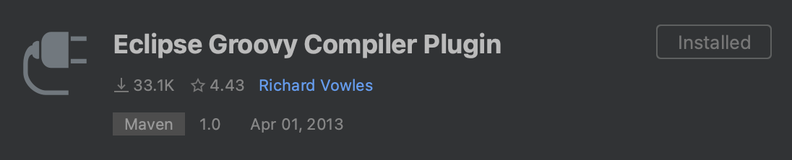

# YAMTL

Yet Another Model Transformation Language (YAMTL) is an expressive model-to-model transformation language that is offered as an internal domain-specific language (DSL) of Java/Xtend. YAMTL was found to be the fastest incremental model transformation tool, in general, for dealing with complex transformations between AADL models according to independent industrial case study. YAMTL is available as an IDE-agnostic Java dependency that augments the Java ecosystem with model analysis and model transformation capabilities that are not yet available in the latest version of Java. YAMTL transformations can be developed, debugged and analysed using the preferred Java IDE of choice and they can build upon existing Java dependencies in order to automate complex tasks. YAMTL operates on models defined with the Eclipse Modeling Framework.


## Installation

YAMTL uses Gradle as build automation tool and can be executed from Java-SE 17. To add YAMTL to your own project you must configure the Gradle build script (build.gradle) of your project.

Add the following repository:
```
repositories {
	maven{ url 'https://github.com/yamtl/yamtl.github.io/raw/mvn-repo/mvn-repo/snapshot-repo' }
	mavenCentral()
}
```

Then declare the dependencies:
```
dependencies {
    implementation "org.eclipse.xtend:org.eclipse.xtend.core:2.31.0" //package versions may be deprecated in the future
	implementation 'yamtl:yamtl:0.4.3'
	implementation 'yamtl:untyped-models:0.0.25'
}
```

## Workspace Configuration

To use YAMTL appropriately, the IDE must be properly configured. Let's check out the required configurations for some of the most popular IDEs: Eclipse, IntelliJ, and VSCode.

### Eclipse

Open Eclipse IDE and head over to ```Help → Eclipse Marketplace```. Enter "groovy" and install ``Groovy Development Tools 5.0.0.RELEASE`` to be able to run groovy scripts.


Before you run any tasks, make sure your project is using **JDK 17 or higher**.

??? info "How to change the Java version in Eclipse"
    To change your JRE, head over to ``Eclipse → Preferences → Java → Installed JREs → Choose Java SE 17 or higher``

Now you should be ready to use YAMTL in your modelling projects.

### IntelliJ

Head over to ``IntelliJ IDEA → Preferences → Plugins`` and search for ``Eclipse Groovy Compiler Plugin`` and install it.



Similarly, search for "gradle" and install the ``Gradle`` plugin from JetBrains. Restart your IDE to apply the changes.

Ensure the project is using **JDK 17 or higher**.

??? info "How to change the Java version in IntelliJ"
    To change your JDK, head over to ``IntelliJ IDEA → Preferences → Build, Execution, Deployment → Build Tools → Gradle``. Then, select a ``Gradle JVM`` that is **JDK 17 or higher**.

All necessary configurations are now completed!

### VSCode

First, a groovy support package must be installed. ``code-groovy`` extension enables Groovy support for VSCode. In VScode, click on ``Extensions`` and search for "code-groovy". Install the extension that looks like the one below.


Also, install the ``Gradle for Java`` extension published by Microsoft to run the Gradle scripts in a neat interface.

Make sure the workspace is using **JDK 17 or higher**.

??? info "How to change the Java version in VSCode"
    To change your JRE, head over to ``Code → Preferences → Settings`` and search for "jdk". Check the Gradle ``Java: Home`` setting to see if the path points to a location of JDK 17 or higher (update the JDK version if it is any lower).

    

The congifurations are completed! Check out the [YAMTL examples](#yamtl-example) below for further understanding.

## Examples

* [Linked list reversal](examples/linked-list-reversal-example.md) project reverses a linked list data structure originally stored in XMI format (source model). YAMTL transformation generates an ``outputList.xmi`` containing the target model. Both source and target metamodels are created using the same ECore file since the data structure remains the same after the transformation. A Gradle test runs a Groovy script that loads the input model, executes the transformation and saves the output model.